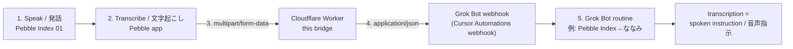

# Pebble → Grok Bot Webhook Bridge

Pebble Index 01 の音声入力を **Grok Bot ルーチン**へ届けるための Cloudflare Worker です。Pebble の `multipart/form-data` webhook を JSON に変換し、Grok Bot ルーチンが利用する Cursor Automations webhook へ転送します。音声ファイル自体は転送しません。

A Cloudflare Worker that sends Pebble Index 01 voice input to a **Grok Bot routine**. It converts Pebble's `multipart/form-data` webhook to JSON, then forwards it to the Cursor Automations webhook used by the Grok Bot routine. The audio file itself is never forwarded.

## Architecture / 構成

Grok Bot ルーチンの webhook トリガーには Cursor Automations webhook が使われます。Pebble には Grok Bot webhook を直接設定せず、必ずこの Worker の URL を設定します。

A Grok Bot routine uses a Cursor Automations webhook as its webhook trigger. Configure Pebble with this Worker's URL, **not** the Grok Bot webhook URL.



Pebble から Grok Bot webhook に直接送ると、content type が合わないため **HTTP 415** になります。この Worker がその差を吸収します。

Sending directly from Pebble to the Grok Bot webhook returns **HTTP 415** because their content types do not match. This Worker bridges that gap.

## Setup / セットアップ

Node.js 22+ と Cloudflare アカウントが必要です。

Requires Node.js 22+ and a Cloudflare account.

### 1. Create the Grok Bot routine / Grok Bot ルーチンを作成

1. Grok Bot で新しいルーチンを作成します（例: `Pebble Index→ななみ`）。
2. Trigger type に **webhook** を選びます。
3. ルーチンの webhook パネルに表示される次の2つをコピーします。
   - **Webhook URL**（`https://api2.cursor.sh/...`）
   - **Authorization** の Bearer 値（`Bearer ...`）
4. ルーチンには、JSON の `transcription` をユーザーが話した指示として扱うよう設定します。

1. Create a Grok Bot routine (for example, `Pebble Index→Nanami`).
2. Select **webhook** as its trigger type.
3. Copy these two values from the routine's webhook panel:
   - **Webhook URL** (`https://api2.cursor.sh/...`)
   - The **Authorization** Bearer value (`Bearer ...`)
4. Configure the routine to treat the JSON `transcription` field as the user's spoken instruction.

> Keep both values secret. Do not commit them to this repository.

### 2. Deploy the Worker / Worker をデプロイ

```bash
npm install
npx wrangler secret put INGEST_TOKEN
npx wrangler secret put CURSOR_WEBHOOK_URL
npx wrangler secret put CURSOR_WEBHOOK_AUTH
npm run deploy
```

Enter the following values when prompted / 入力する値:

| Secret | Value / 値 |
| --- | --- |
| `INGEST_TOKEN` | Pebble と Worker 間で使う任意の短い共有トークン / A short shared token of your choice for Pebble → Worker |
| `CURSOR_WEBHOOK_URL` | Grok Bot ルーチンの webhook パネルからコピーした **Webhook URL** / The **Webhook URL** copied from the Grok Bot routine panel |
| `CURSOR_WEBHOOK_AUTH` | 同じパネルからコピーした **Bearer 値のみ**（`Bearer ...`）/ The **Bearer value only** copied from the same panel (`Bearer ...`) |

For `CURSOR_WEBHOOK_AUTH`, enter:

```text
Bearer <token>
```

Do **not** enter the complete header line:

```text
Authorization: Bearer <token>
```

### 3. Configure Pebble / Pebble アプリを設定

Pebble アプリの webhook 設定:

- **Webhook URL:** デプロイされた Worker URL（`https://<worker-name>.<subdomain>.workers.dev` または末尾に `/pebble`）
- **Authorization header:** `Bearer <INGEST_TOKEN と同じ値>`
- **Send:** Transcription

Pebble app webhook settings:

- **Webhook URL:** the deployed Worker URL (`https://<worker-name>.<subdomain>.workers.dev`, optionally ending in `/pebble`)
- **Authorization header:** `Bearer <the same value as INGEST_TOKEN>`
- **Send:** Transcription

Do not put the `api2.cursor.sh` Grok Bot webhook URL in the Pebble app. It belongs only in the Worker's `CURSOR_WEBHOOK_URL` secret.

## JSON sent to Grok Bot / Grok Bot に送る JSON

The Worker discards audio and sends this shape to the Grok Bot / Cursor Automations webhook:

```json
{
  "transcription": "明日の午前9時に今日の予定をまとめて",
  "recordedAt": "2026-09-15T16:30:00.000Z",
  "client": "pebble-index-01",
  "source": "pebble-index"
}
```

- `transcription`, `recordedAt`, and `client` come from Pebble's multipart fields.
- `source` is added by this Worker.

## Pitfalls / よくある問題

1. **HTTP 415:** Pebble から Grok Bot / Cursor Automations webhook へ直接送らないでください。Pebble は multipart、Grok Bot webhook は JSON を受け取ります。
2. **HTTP 401:** `CURSOR_WEBHOOK_AUTH` に `Authorization:` を含めないでください。保存するのは `Bearer ...` の部分だけです。
3. **First deploy:** 初回デプロイ前に、Cloudflare アカウントで `workers.dev` subdomain を一度登録する必要があります。
4. **Truncated token:** Pebble UI では長い Bearer token が切れる場合があります。`INGEST_TOKEN` は短くしてください。これは Grok Bot の長い Authorization token とは別の値です。

## License

MIT
